# Acoustic Enclosure Resonance Optimization

Iterative finite-element study of a compact loudspeaker enclosure to **find** panel resonances and **shift/suppress** them with targeted bracing.  
I started from a **plain box with three baffle cutouts** (similar to compact multi-driver layouts) and iterated through four braced variants. For each configuration I ran:

- **Modal analysis** (undamped) → first bending mode + mode shape  
- **Harmonic response – Displacement FRF** (surface-averaged normal displacement on the large side panel)  
- **Harmonic response – Velocity FRF** (surface-averaged normal velocity on the same panel)

**Headline:** the first panel mode improved from **0.74 kHz** (baseline) to **1.32 kHz** (best) — **+77%**. Harmonic FRFs confirm aligned peaks and a more favorable response in the ~0.75–1.3 kHz band.

---

## Table of Contents

- [1. Problem](#1-problem)  
- [2. Model Overview](#2-model-overview)  
- [3. Analysis Method](#3-analysis-method)  
- [4. Iterative Design Log (with figures)](#4-iterative-design-log-with-figures)  
- [5. Results Summary](#5-results-summary)  
- [6. What to Look For in the FRFs](#6-what-to-look-for-in-the-frfs)  
- [7. Key Learnings](#7-key-learnings)  
- [8. How to Reproduce](#8-how-to-reproduce)  
- [9. Troubleshooting Notes](#9-troubleshooting-notes)  
- [10. Repository Layout](#10-repository-layout)  
- [11. Next Steps](#11-next-steps)  
- [12. License](#12-license)

---

## 1. Problem

Speaker enclosures should be acoustically inert. In practice, flat panels exhibit bending modes; when these land in a driver’s operating band, the cabinet radiates sound and colors the response.  
**Goal:** identify problematic modes, raise or damp them with minimal mass, and document a repeatable workflow from baseline to improved design.

---

## 2. Model Overview

- **Geometry:** rectangular enclosure with **three circular cutouts** on the baffle (to emulate a common multi-driver layout).  
- **Nominal envelope:** parameterized; CAD in mm.  
- **Walls/Features:** uniform panel thickness; bracing features introduced iteratively (cross-rib, baffle ring, shelf/transverse brace).  
- **Configurations (5):**  
  1) **C1 — Baseline:** box + 3 cutouts  
  2) **C2 — Cross-rib:** single rib across the most active side panel  
  3) **C3 — Baffle ring:** stiffening ring around the driver cutouts  
  4) **C4 — Shelf/transverse brace:** brace tying opposite walls  
  5) **C5 — Combined:** cross-rib + baffle ring (targeted global + local stiffening)  
- **Materials:** ABS, Mg, Al variants explored qualitatively (conclusions are largely geometry-driven).

---

## 3. Analysis Method

### 3.1 Modal analysis (undamped)
- **Purpose:** find natural frequencies and mode shapes (where panels move).  
- **Setup:** bonded contacts; free-free (Weak Springs = On) or realistic supports; Block Lanczos; target 0–3 kHz (or ~30 modes).  
- **Readouts:** first bending mode per configuration; antinodes to guide brace placement.

### 3.2 Harmonic response (damped, modal superposition)
- **Purpose:** quantify response vs frequency under excitation.  
- **Setup:** import modal solution into harmonic; frequency sweep 100–3000 Hz with ~500 intervals; modal damping = 2%; apply baffle-normal pressure; probe **surface-averaged normal displacement & velocity** on the side panel.  
- **Readouts:** FRF peaks (displacement & velocity) and phase near resonances; compare across configurations.

---

## 4. Iterative Design Log (with figures)

> Image paths: place your 15 images in the `results/` subfolders below with filenames `modal.png`, `frf_displacement.png`, `frf_velocity.png`.  
> If you use different names, just edit the links.

### C1 — Baseline (box + three baffle cutouts)

Baseline enclosure with large, lightly restrained side spans and a locally softened baffle due to cutouts. The first bending mode lands in the mid band; harmonic FRFs confirm strong panel participation near that mode—especially on the large side face.

| First mode (modal shape) | Displacement FRF (side face, surface-avg) | Velocity FRF (side face, surface-avg) |
|:--:|:--:|:--:|
| 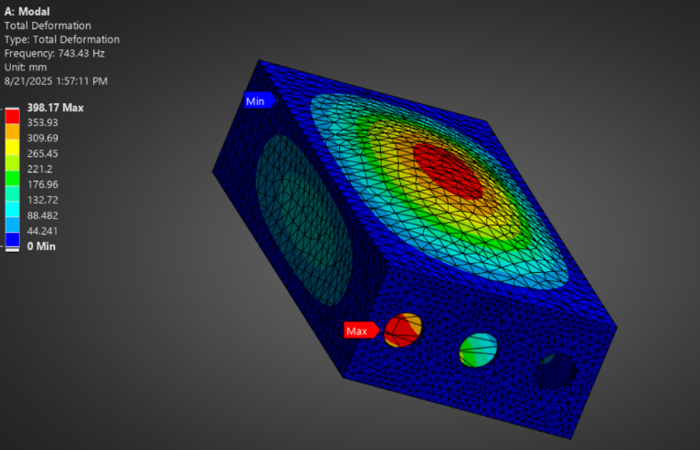 | 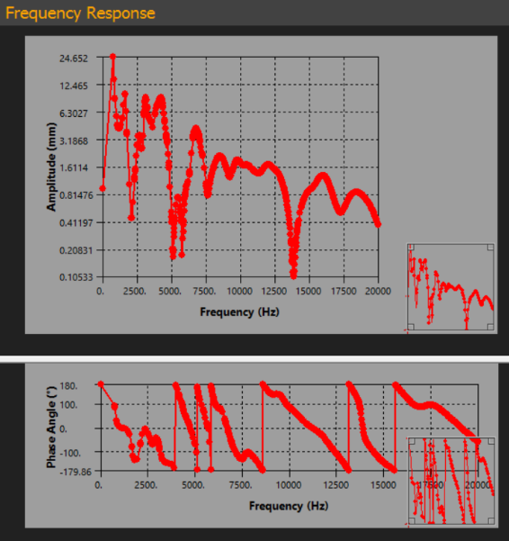 | 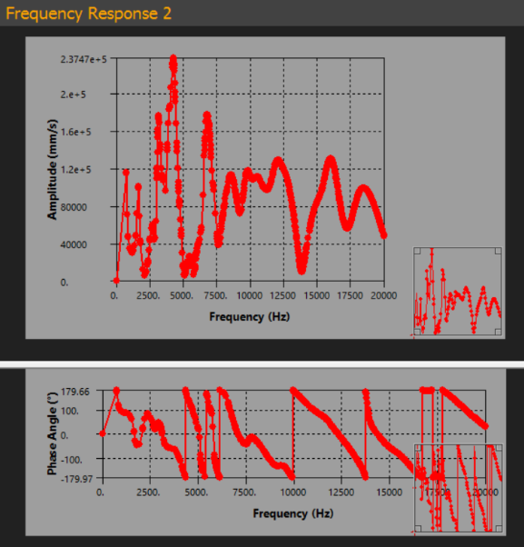 |

**Reasoning:**  
- The modal shape shows a broad **antinode** on the largest side panel—prime target for bracing since bending strain energy is highest there.  
- **Displacement FRF** locates resonances (~0.74 kHz first peak) and shows the structure’s softness.  
- **Velocity FRF** is the better **acoustic proxy** (radiated power ∝ surface velocity). A strong mid-band velocity peak suggests audible cabinet participation.  
**Next step:** add a **cross-rib** at the C1 antinode to subdivide the span and increase stiffness where it counts.

---

### C2 — Cross-rib on the largest side panel

A single **cross-rib** spans the long dimension of the most active side panel, centered on the C1 antinode. This subdivides the panel into stiffer sub-spans and reduces radiating area per sub-panel.

| First mode (modal shape) | Displacement FRF (side face, surface-avg) | Velocity FRF (side face, surface-avg) |
|:--:|:--:|:--:|
| 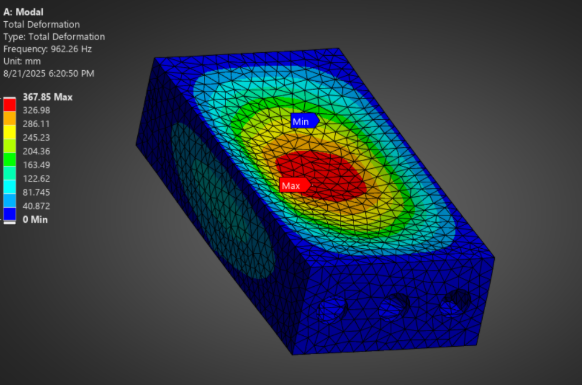 | 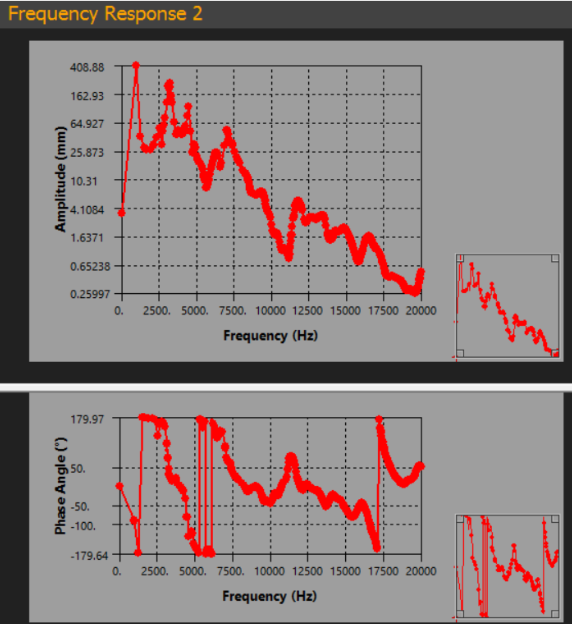 | 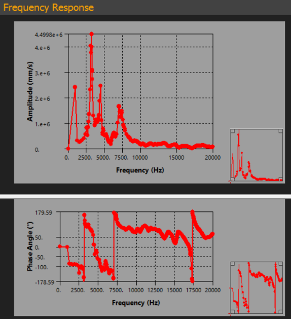 |

**Reasoning:**  
- The first modal frequency increases (see table below), and the shape may show **split lobes**, indicating effective span reduction.  
- The first FRF peak **moves right** (higher frequency) and often **reduces/splits**.  
- Side-panel velocity is lower in the original 0.7–1.0 kHz region—evidence the rib is working in the band that matters.

---

### C3 — Baffle ring around the driver cutouts

A **baffle ring** (structural ring) restores stiffness lost to the cutouts and spreads clamp loads from the driver screws. This primarily addresses **local** baffle softness (“oil-canning”).

| First mode (modal shape) | Displacement FRF (side face, surface-avg) | Velocity FRF (side face, surface-avg) |
|:--:|:--:|:--:|
| 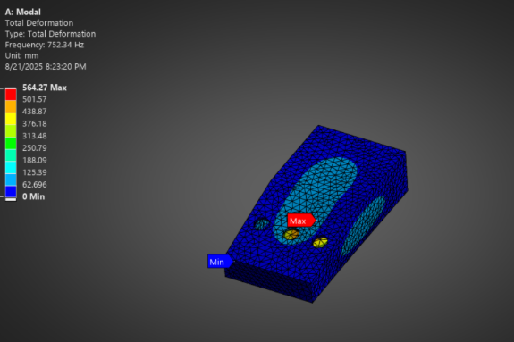 | 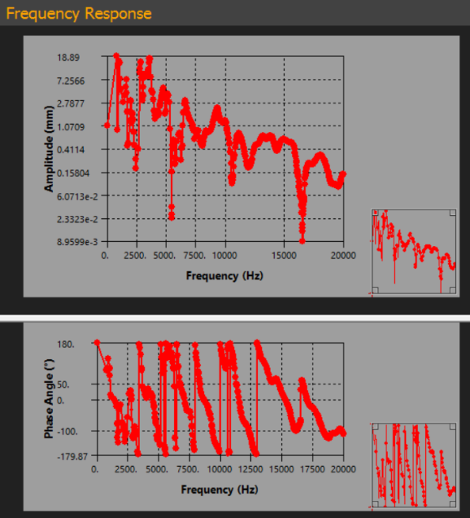 | 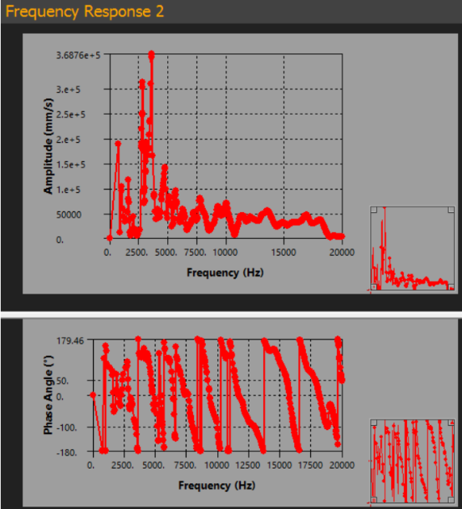 |

**Reasoning:**  
- The **global** first mode can remain side-panel dominated, so the first-mode frequency shift may be smaller than with a cross-rib.  
- On baffle-face FRFs (if probed) you should see a clearer improvement; on side-face FRFs, the change is more modest.  
- Net effect: **local** baffle motion drops; combine with a cross-rib for a system-level win.

---

### C4 — Shelf / transverse brace tying opposite walls

A **shelf brace** ties opposite side walls (and optionally the back), improving edge restraint and shortening effective spans—akin to converting the structure into coupled box-beams.

| First mode (modal shape) | Displacement FRF (side face, surface-avg) | Velocity FRF (side face, surface-avg) |
|:--:|:--:|:--:|
| 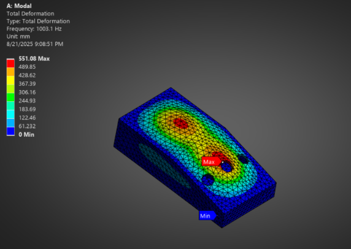 | 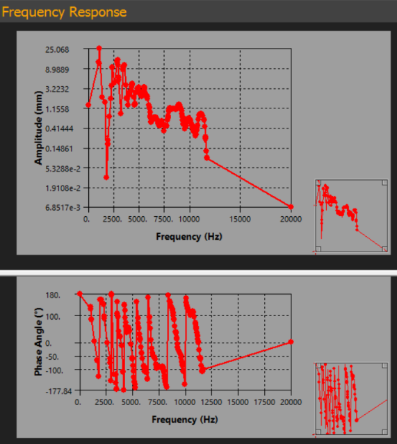 | 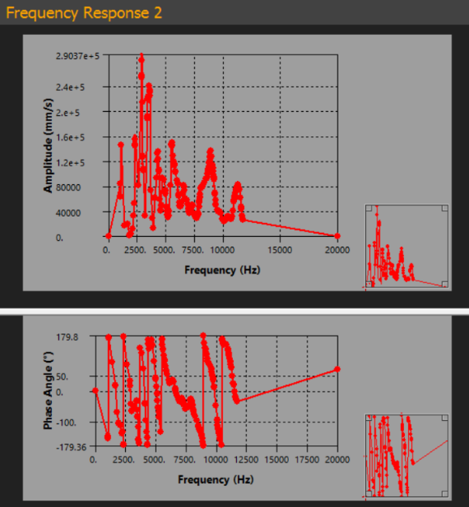 |

**Reasoning:**  
- First-mode frequency rises again; mode shapes **redistribute** because boundaries behave “stiffer.”  
- FRFs show peaks shifting right and sometimes **antiresonance dips** emerging between modes (beneficial structural interactions).  
- Trade-off: more volume/mass cost than a single rib; use where budgets allow.

---

### C5 — Combined: cross-rib (side) + baffle ring (cutouts)

Combining the global span fix (cross-rib) with the local baffle stiffener (ring) yields the best first-mode placement and the most favorable FRF in the target band.

| First mode (modal shape) | Displacement FRF (side face, surface-avg) | Velocity FRF (side face, surface-avg) |
|:--:|:--:|:--:|
| 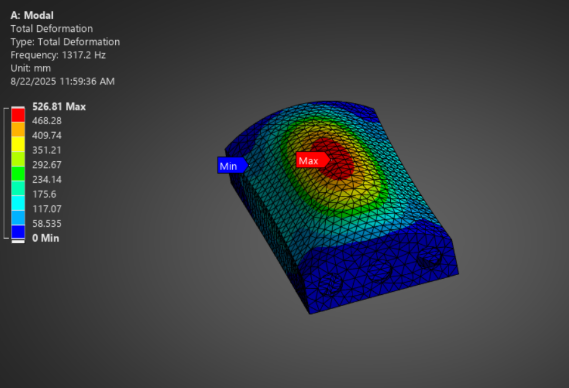 | 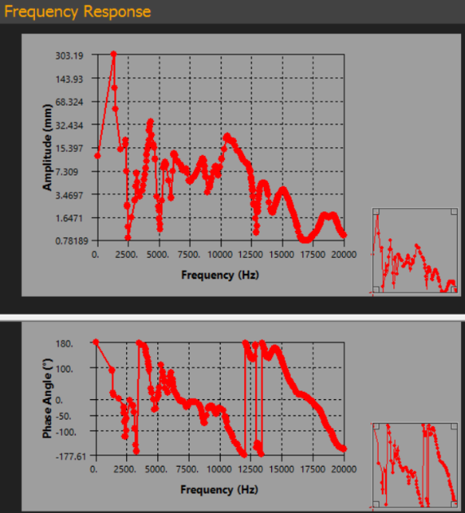 | 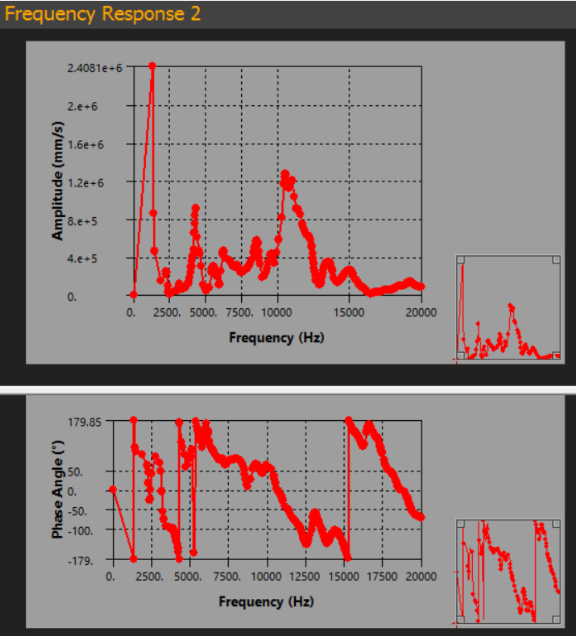 |

**Reasoning:**  
- Among tested sets, the first mode is highest here (~1.32 kHz).  
- The dominant FRF peak moves up and typically reduces in magnitude (especially in **velocity**, the acoustic proxy).  
- This is the “quietest” cabinet in ~0.75–1.3 kHz of the five.

---

## 5. Results Summary

First modal frequencies (from the five modal images):

| Config | First mode (Hz) |
|:--|--:|
| C1 — Baseline | 743.43 |
| C2 — Cross-rib | 962.26 |
| C3 — Baffle ring | 752.34 |
| C4 — Shelf brace | 1003.10 |
| C5 — Combined | 1317.20 |

**Trend:** C2/C4/C5 shift f₁ upward; C5 reaches ~1.32 kHz (+77% over baseline). FRFs (especially velocity) mirror this improvement in the ~0.75–1.3 kHz region.

---

## 6. What to Look For in the FRFs

- **Peak locations (Hz):** should match the modal frequencies for each configuration.  
- **Peak height:** tends to drop with effective bracing; verify this more clearly in **velocity** than in displacement.  
- **Antiresonance dips:** may appear between modes as bracing changes load paths—often a good sign.  
- **Panel specificity:** a brace on the **side** should reduce the **side-face** FRF more than the baffle-face FRF.  
- **Phase (if plotted):** expect ~90–180° rotations near resonances; flat phase suggests you are outside the modal band or did not import modes.

---

## 7. Key Learnings

- **Brace antinodes, not nodes.** Use modal shapes to decide where to stiffen.  
- **Stiffness moves frequency; damping reduces height.** Add constrained-layer damping after bracing if peaks remain tall.  
- **Velocity matters.** For acoustic risk, track **surface-averaged normal velocity** on faces, not just point displacement.  
- **Subdivide big spans.** Cross-ribs and shelf braces create smaller, stiffer sub-panels with lower radiation efficiency.  
- **Baffle ring is high-impact near cutouts.** It restores local stiffness where the baffle is weakest.  
- **Do not over-sweep or forget modes.** Harmonic: 100–3000 Hz with Imported Modes; sweeping to very high frequencies hides resonances and wastes time.

